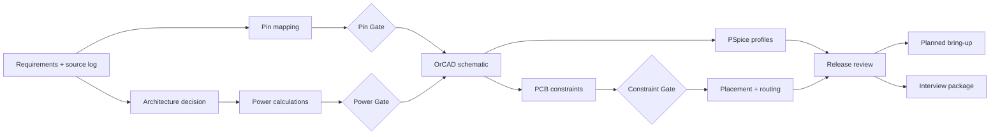

# 專案執行計畫

## 目標與成功條件

目標是在八週內建立一套可審查、可追溯、可由 Cadence native flow 延伸至投板的 Rev A 設計作品集。成功不以「文件很多」判定，而以需求閉環、design gate、可重現工具輸出與誠實的證據狀態判定。

成功條件：

1. PCIe Gen3 x4、M.2 M-Key、sideband 與 power connectivity 均可追溯至來源。
2. 5 A steady-state 與 7 A / 100 µs transient stimulus 均有計算、PSpice 設定與 pass/fail criteria。
3. 六層 stack-up、impedance geometry 與 routing constraints 由投板當下板廠資料凍結。
4. OrCAD、PSpice、PCB 與製造輸出均能由同一版 source data 重建。
5. 實機未測項目持續標為 `Not_Yet_Measured`，不宣稱 compliance。

## 八週工作分解

| 時程 | 工作包 | 可交付成果 | Gate／驗收 |
|---|---|---|---|
| Week 1 | Repository baseline | 核心文件、CSV schema、初版 BOM／net matrix／constraints、四個檢查器 | 檔案 manifest 完整；valid fixtures 通過；negative fixtures 正確失敗 |
| Week 1–2 | Architecture and power definition | A/B trade-off、推薦與備選料、power／thermal／derating 計算 | Power Design Gate；slot power 與 exact MPN 已確認 |
| Week 2–3 | OrCAD Capture | 七頁階層式 schematic、symbols、footprints、ERC、netlist | Pin Mapping Gate；native project round-trip；ERC 無未解釋項 |
| Week 3–4 | PSpice | startup、inrush、load／line transient、ripple、tolerance profiles | 每個 profile 可重現；結果只依實際 run 標為 `Simulated` |
| Week 4–6 | PCB implementation | outline、placement、stack-up、constraints、routing reviews、DRC | PCB Constraint Gate；return path、mechanical、DRC 全數審查 |
| Week 6–7 | Release and bring-up preparation | Gerber、drill、BOM、P&P、assembly、release package、test plan | CAM／release checklist 通過；未下板項目為 `Planned` |
| Week 7–8 | Portfolio packaging | 10 頁簡報、三種 pitch、履歷 bullets、問答、project story | 技術主張皆可連回文件或工具證據 |

## Design gates

### Gate 1 — Pin Mapping Freeze

通過條件：

- PCIe edge 與 M.2 connector 的 lane 0–3、P/N、TX/RX direction 已逐 pin 覆核。
- REFCLK、PERST#、CLKREQ#、PEWAKE# 與 PRSNT 已確認。
- AC coupling capacitor ownership 已由 governing specification 確認；本板沒有未經證實的額外 coupling。
- 每個 critical row 都有 official source 與第二份公開原廠設計交叉檢查。
- `Pending_Human_Verification` 數量為 0，且 reviewer／日期留痕。

未通過時：不得進行正式 Capture 接線或宣稱 pin map 正確。

### Gate 2 — Power Design Freeze

通過條件：

- PCIe slot 12 V pin、available power、inrush／hot-plug 邊界由正式 CEM 資料確認。
- exact TPS25947-family MPN、fault response、current limit、slew rate 與 thermal SOA 已決定。
- 5 A steady-state 與 7 A / 100 µs stimulus 的 input、output、inductor、shunt、loss、temperature rise 與 derating 已計算。
- TPS543620 transient model 已保存版本、URL、取得日期與 hash。
- 支援的 SSD 清單與排除條件已建立；超出 verified envelope 的 SSD 不列為支援。

未通過時：限制支援範圍，不以 6 A nominal rating 推論 7 A transient 能力。

### Gate 3 — PCB Constraint Freeze

通過條件：

- 投板當下的 JLCPCB 1.6 mm 六層 stack-up 與 impedance calculator evidence 已保存。
- differential impedance、trace geometry、reference layer、via rule、spacing、skew 與 length rule 已由適用規格及 stack-up 共同決定。
- L1/L2 與 L6/L5 reference relationship 無 plane split；layer transition 有鄰近 return vias。
- high-current loop、switch-node keepout、Kelvin sense、thermal via 與 test-point access 已審查。

未通過時：所有 geometry 維持 `Pending_Fabricator_Confirmation`，不得 release。

## 執行順序與相依性

## 工作紀律

- 每項結論都先記錄 source、assumption 與 status，再進入 CAD。
- 每個里程碑只升級有證據的狀態；`Planned` 不等於 `Simulated`，`Simulated` 不等於 measured。
- 任何 model convergence failure、tool limitation 或 license limitation 都保存 log，不補畫波形。
- Native Cadence files 只由已驗證的 GUI／batch flow 產生；Tcl／SKILL automation 若使用，標為 experimental 並保留人工覆核。
- 任一變更若影響需求、pin mapping、power、constraint 或 manufacturing output，必須記錄於 `CHANGELOG.md` 並重新跑受影響的 gate。

## 發行判定

Rev A 只有在三個 Gate、ERC、PSpice review、DRC、footprint／mechanical review 與 CAM checklist 全數無未解釋項目時才可標記 `Release_Candidate`。是否製作實體板是另一個決策；未製作時，bring-up 與量測仍維持 `Planned`／`Not_Yet_Measured`。

## 2026-07-23 Gate snapshot

- Gate 1 未通過：NVIDIA 公開資料已提供 lane／sideband 候選交叉檢查，但 CEM 3.0
  的 B12 為 reserved，而較新設計把它用作 `CLKREQ#`；M.2 pin 32 也有 GND／NC
  revision 差異。所有 critical physical Pin 繼續保持 `PENDING_*`。
- Gate 2 未通過：TPS543620 與 TPS25947x 官方 PSpice ZIP、版本與 SHA-256 已保存，
  但 isolated TPS25947x smoke test 功能驗收失敗；slot power、inrush、eFuse 設定與
  7 A／100 µs canonical transient 尚未關閉。
- Gate 3 未通過：JLCPCB 當期 quote／stack-up／calculator evidence 尚未凍結，
  geometry 繼續為 `Pending_Fabricator_Confirmation`。
- Capture executable 與可見 license 已確認；Rev A native save／reopen／ERC／netlist
  round-trip 尚未完成。
