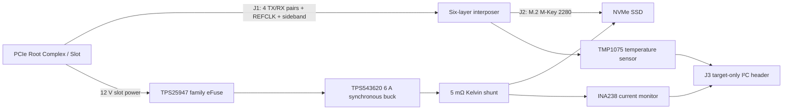

# PCIe Gen3 x4 → M.2 NVMe Adapter — Technical Case Study

**NVIDIA LDE interview portfolio · Rev K / RevK evidence · `Interview_Digital_Complete_Not_For_Fabrication`**<br>
這份報告把 repository 由「檔案清單」改成一個可追溯的 PCB system-design 故事。所有結論都連回原理圖資料、PSpice record、native Allegro/3DX evidence 或製造輸出；未量測或未取得受控來源的項目維持 open/block status。

> **Boundary:** 本板是 PCIe host 與 M.2 NVMe SSD 之間的 passive physical interposer，不是 PCIe protocol converter。未宣稱 PCIe compliance、universal SSD support、chassis compatibility、bench qualification、SI/PI sign-off 或 fabrication-ready。

## 1. Executive summary / 專案摘要

我設計一張 low-profile、half-length、六層的 PCIe Gen3 x4 add-in card，將主機的 PCIe edge connection 引到 M.2 M-Key 2280 NVMe connector。專題的重點不是畫一張漂亮板，而是把 system intent、pin/net interface、power integrity 假設、3DX/STEP mechanical handoff、CAM 輸出與 Python negative tests 串成可審查的工程流程。

目前 RevK 的 digital closure 包含 native board、current-board 3DX views、AP242/mm STEP re-import、DRC/connectivity/shape reports、Gerber/NC Drill/IPC-2581、BOM/P&P 與 validators。剩餘問題被保留在矩陣中：受控 CEM/M.2 physical pin source、JLCPCB stack-up/impedance freeze、exact mechanical context、power-model recovery failure、eFuse validation 與 physical bring-up。

- Board baseline: 120 × 64 mm preliminary envelope, 1.6 mm nominal, six copper layers.
- Power target: 3.3 V / 5 A normal; 7 A / 100 µs is an engineering pulse, not a product rating.
- Current board evidence: DRC 0, unconnected 0, active rats 0, shape islands 0, nine native differential-pair objects.
- Status: digital/interview package complete; fabrication and hardware qualification blocked by documented gates.

## 2. What the board actually does / 功能邊界

### Signal path

The host Root Complex remains the PCIe protocol owner. J1 routes four TX/RX lane pairs, REFCLK and sidebands to J2. J2 is the M.2 M-Key 2280 mating point for an NVMe SSD. There is no retimer, switch, bridge, firmware or packet conversion logic on this board.

### Power path

PCIe slot 12 V is protected, converted and sensed before reaching the SSD. A separate auxiliary path supports telemetry and debug without allowing the external I²C header to back-feed the board.

### Telemetry path

INA238 measures the 5 mΩ Kelvin shunt; TMP1075 measures local board temperature. J3 exposes GND/SCL/SDA/3.3 V sense only. Address, pull-up and alert ownership remain a review item.

See [`docs/interface_definition.md`](docs/interface_definition.md) and [`docs/system_block_diagram.md`](docs/system_block_diagram.md) for the source interface definition.



## 3. Requirements and verification contract / 需求與驗證

| Requirement | Design response | Current status |
|---|---|---|
| PCIe Gen3 x4 physical connection | Eight data pairs plus REFCLK pair, short paired corridors, no unowned lane capacitors | Logical intent verified; physical pin freeze blocked |
| M.2 M-Key 2280 interface | J2 placement, SSD envelope, longitudinal mechanical baseline | Preliminary; exact mating/chassis context open |
| Low-profile six-layer board | L1 components/high-speed, L2 GND, L3 sideband, L4 power, L5 GND, L6 low-speed/edge breakout | Native baseline verified; fabricator geometry pending |
| 3.3 V / 5 A normal target | eFuse → 6 A buck → Kelvin shunt power chain | Engineering target; not bench-qualified |
| 7 A / 100 µs pulse study | Official buck model profile plus retained raw logs | Simulation-limited; recovery screen fails |
| Reviewable release package | Reports, hash-bound evidence, CAM outputs, STEP and Python checks | Digital package complete; not fab release |

The claim-to-evidence details are in [`docs/CLAIM_EVIDENCE_MATRIX.md`](docs/CLAIM_EVIDENCE_MATRIX.md).

## 4. Architecture and trade-offs / 架構選擇

I compared Architecture A (slot 3.3 V distribution) with Architecture B (slot 12 V plus local conversion). The weighted worksheet scores A 3.85 and B 3.45, but I selected B for this interview project because it exposes eFuse behavior, buck control, current sensing, hot-loop placement and PSpice work in one board. This is an engineering-portfolio decision, not a claim that B is universally superior.

| Decision | Options considered | Selected implementation | Verification / remaining risk |
|---|---|---|---|
| Input power | Slot 3.3 V vs 12 V conversion | 12 V → TPS25947-family → TPS543620 | [`docs/architecture_tradeoff.md`](docs/architecture_tradeoff.md); slot budget and inrush still need controlled-source confirmation |
| Protection | Fuse, load switch, eFuse | Current-limit/soft-start eFuse candidate | Model functional validation failed; ILIM/dVdt/ITIMER/SOA not frozen |
| Buck size | Smaller regulator vs 6 A class | TPS543620, with 5 A normal target and 7 A pulse screen | Official model exists; system recovery is not closed |
| Current sensing | No telemetry vs shunt monitor | 5 mΩ four-terminal Kelvin shunt + INA238 | Routing intent documented; calibration/bench data open |
| Temperature | No sensor vs local monitor | TMP1075 near power/SSD zone | I²C ownership and measured thermal result open |
| High-speed conditioning | Add AC caps/CMC/ESD vs preserve lane | No added lane conditioning before transmitter ownership is confirmed | Avoids an unverified topology change; CEM/M.2 source gate remains |
| Layer strategy | Mixed reference planes vs symmetric references | L1/L6 reference L2/L5; L4 power; L3 sideband | Width/gap/via geometry pending JLCPCB stack-up |
| Manufacturing exchange | ODB++/IPC-356 vs available exports | Gerber + NC Drill + IPC-2581-C; ODB++ unavailable, IPC-356 empty excluded | Output generation verified, DFM/fab approval open |

## 5. Capture and electrical interface / 原理圖與介面

The intended Capture deliverable is a seven-page hierarchy with formal symbols, pin map, footprint assignments, annotation, ERC and netlist reports. The public evidence is deliberately machine-readable:

- [`schematic/connection_matrix.csv`](schematic/connection_matrix.csv) is the logical source of nets, pins and statuses.
- [`schematic/symbol_pinmap.csv`](schematic/symbol_pinmap.csv) records symbol-level pins.
- [`schematic/footprint_assignment.csv`](schematic/footprint_assignment.csv) binds references to packages.
- [`schematic/orcad/stage2/reports/erc_report.txt`](schematic/orcad/stage2/reports/erc_report.txt) is the native-tool ERC evidence.

The key design discipline is to keep a logical name stable while refusing to invent a physical connector pin number. Therefore `PENDING_J1_*` and `PENDING_J2_*` are not silently promoted to `Confirmed_Official`; the B12/CLKREQ# and M.2 pin-32 conflict is called out in [`docs/pcie_m2_pin_mapping.md`](docs/pcie_m2_pin_mapping.md).

## 6. Power design and PSpice / 電源與模擬

The power calculation starts with `P = V × I`, a 5 mΩ shunt, effective capacitor rather than nominal label value, and a stated efficiency assumption. The full assumptions and calculations are in [`docs/power_budget.md`](docs/power_budget.md) and [`docs/component_selection.md`](docs/component_selection.md).

| Profile | Recorded observation | Disposition |
|---|---|---|
| Solver smoke | PSpice command-line solver concluded | Simulated pass; not a power-stage result |
| Startup / soft-start | 820 µs window ended while soft-start was active | Partial, not steady-state proof |
| 5 A steady | 3.149 V minimum in the recorded combined profile | Passes the 3.135 V screen for that model window only |
| 7 A / 100 µs | 3.204 V minimum in the recorded pulse window | Passes that model window only; 8.656 A peak inductor current is a margin concern |
| Recovery | 3.109 V minimum while PGOOD remained high | **Simulated failure** against the 3.135 V lower screen |
| eFuse isolated run | Encrypted model did not reach valid output startup | Functional validation failed / human review required |
| Loop stability / Monte Carlo | Model does not expose a supported small-signal/statistical path | `Not_Supported_By_Model` |
| COUT/ESR/CFF sweep | 27 cases saved with hashes, but runtime-limited | `Not_Concluded_Runtime_Limit`; no pass inferred |

The 132 µF / 3 mΩ / 8.2 pF candidate was a diagnostic rerun, not a released BOM value. The exact runtime record and hashes are in [`pspice/stage3/run_record.md`](pspice/stage3/run_record.md) and [`pspice/stage3/recovery_sweep/recovery_sweep_results.csv`](pspice/stage3/recovery_sweep/recovery_sweep_results.csv). A technically correct next step is to reduce the model/runtime problem, correlate layout parasitics, and rerun before making any supported-SSD claim.

## 7. PCB implementation and high-speed intent / PCB 與高速規劃

The native RevK board contains placement, copper-layer intent, shapes and nine differential-pair objects. The placement order is connector/SSD/mechanical envelope → PCIe corridors → eFuse/buck hot-loop → shunt/telemetry → debug points. L2 and L5 are GND references; L4 contains the named power regions. The current evidence reports DRC 0, unconnected 0, active rats 0 and zero shape islands.

This is digital PCB closure, not SI/PI closure. Pair widths, gaps, via drill/pad, anti-pads, reference layer, length skew and back-drill remain `Pending_Fabricator_Confirmation` until the actual JLCPCB stack-up and governing PCIe/M.2 requirements are loaded into Constraint Manager. See [`pcb/constraints.csv`](pcb/constraints.csv), [`pcb/differential_pairs.csv`](pcb/differential_pairs.csv) and [`evidence/stage3/constraint_manager_status.md`](evidence/stage3/constraint_manager_status.md).

## 8. Mechanical review, 3DX and STEP / 機構與 3D

Native 3DX views are evidence of the current board database, not decoration. The repository keeps engineering UI views in [`evidence/stage3/3dx_native_revk/`](evidence/stage3/3dx_native_revk/) and cleaner portfolio views in [`evidence/stage3/portfolio_revk/`](evidence/stage3/portfolio_revk/). The assembly STEP is AP242/mm and has an isolated native DRA readback recorded in [`evidence/stage3/3d_status.md`](evidence/stage3/3d_status.md).

The SSD body and several mechanical bodies are conservative or drawing-derived envelopes. Exact chassis, bracket, standoff, cable and mating J2 transforms are not all controlled, so `3D-01`/`3D-08` can be preliminary-clear while other collision cases remain blocked. A rendered image cannot upgrade a missing model to a collision Pass.

## 9. Manufacturing and release / 製造輸出

| Output | Current state | Boundary |
|---|---|---|
| Gerber artwork | Generated and hash-listed | Engineering review; not DFM approval |
| NC Drill | Generated, two drill files | Tooling/board-house review still required |
| IPC-2581-C | Generated | Intelligent exchange present; not a fabrication sign-off |
| BOM / P&P | Generated preliminary | Procurement, alternates and assembly review open |
| STEP | Generated preliminary and re-imported | Exact mechanical fit open |
| IPC-356 | Empty output excluded | Not claimed as delivered |
| ODB++ | Not supported by installed tool | Not claimed as delivered |

The package-level status and artifact hashes are in [`manufacturing/stage3_final_revk/README.md`](manufacturing/stage3_final_revk/README.md), [`manufacturing/stage3_final_revk/export_status.csv`](manufacturing/stage3_final_revk/export_status.csv) and [`manufacturing/stage3_final_revk/artifact_manifest.csv`](manufacturing/stage3_final_revk/artifact_manifest.csv).

## 10. Automation and negative tests / 自動化

The project uses standard-library Python (`csv`, `argparse`, `pathlib`, `unittest`) as a review layer around native Cadence reports. Typical commands are:

```powershell
python scripts/validate_csv.py --root .
python scripts/check_bom_fields.py manufacturing/bom.csv
python scripts/check_duplicate_pins.py schematic/connection_matrix.csv schematic/symbol_pinmap.csv
python scripts/check_net_names.py schematic/connection_matrix.csv
python scripts/check_documentation_links.py --root .
python scripts/check_portfolio_i18n.py
python -m unittest discover -s scripts -p "test_*.py" -v
```

Negative fixtures cover missing BOM columns/MPN, duplicate pins, invalid nets, Stage 2 missing pin/pad mismatch/unplaced component, stale hash, missing evidence and false routing claims. The validators test data contracts; they do not parse proprietary `.brd`/`.dsn` binaries or replace human review of native Cadence reports.

## 11. Results and limitations / 結果與限制

| Area | Result | Confidence |
|---|---|---|
| System architecture and interface narrative | Closed as a reviewable design intent | Verified against source docs |
| Native board digital closure | DRC/connectivity/shape counters closed for RevK | Verified by current gate report |
| Power topology | Implemented as a design baseline | Preliminary |
| Official buck profile | 5 A and 7 A windows recorded; recovery fails | Simulation-limited |
| eFuse behavior | Isolated validation did not conclude | Blocked/open |
| Constraint Manager | Pair objects exist; impedance geometry not frozen | Blocked by stack-up/spec |
| 3DX/STEP | Current-board views and round-trip evidence exist | Verified for handoff loop; fit preliminary |
| Manufacturing files | Digital outputs generated | Preliminary, not fab-ready |
| Physical bring-up | No board measurement | Open |

## 12. Rev L / next revision plan

Rev L should be a controlled ECO, not a cosmetic redraw:

1. Obtain legal PCIe CEM and M.2 controlled specifications; freeze J1/J2 physical pins and record revision/page evidence.
2. Import the current JLCPCB six-layer stack-up; calculate and freeze width/gap/via geometry and update Constraint Manager.
3. Close the 3.109 V recovery issue with a faster/partitioned model or measured correlation; rerun 5 A, 7 A/100 µs and line/load corners.
4. Validate TPS25947 current-limit, soft-start, inrush and latch-off behavior with a supported model or bench plan.
5. Replace preliminary mechanical envelopes with exact vendor STEP/drawing transforms; rerun `3D-01`–`3D-08`.
6. Run DFM/CAM review, obtain a board-house quote, fabricate a small lot, and then execute safe power-up → SSD insertion → enumeration → link width/speed → NVMe identify → stress → thermal sequence.

## 13. Demonstrated skills / 展示的能力

- Translating a system requirement into connector, lane, sideband, power and telemetry interfaces.
- Making an architecture trade-off visible instead of hiding it in a schematic.
- Building a Capture-to-Allegro source chain with symbol/pin/footprint traceability.
- Reasoning about buck current, effective capacitance, Kelvin sensing, hot-loop placement and transient limits.
- Defining differential-pair intent and reference-plane strategy without inventing fabricator geometry.
- Using native 3DX/STEP as an auditable MCAD handoff, not as a substitute for exact fit.
- Preserving failed/partial simulation evidence and writing validators/negative tests around native-tool reports.
- Communicating scope, uncertainty and release gates—the core behavior expected from a junior board-design engineer.

## 14. Interview walkthrough / 面試用法

- **30 seconds:** show the hero image and say “passive PCIe Gen3 x4 to M.2 adapter; six layers; protected 12 V to 3.3 V power; current result is digital interview closure, not a fabricated product.”
- **2 minutes:** use the architecture diagram, explain why Architecture B was selected, then show DRC/connectivity and 3DX/STEP evidence.
- **5 minutes:** open the Capture matrix, power profile table, nine differential pairs and manufacturing status. Mention the 3.109 V recovery failure before the interviewer asks.
- **10 minutes:** walk through the claim matrix, the B12/Pin32 pin-source gate, JLCPCB stack-up dependency, eFuse validation gap, and the Rev L closure plan.

The complete question-and-answer script is [`docs/INTERVIEW_GUIDE.md`](docs/INTERVIEW_GUIDE.md); the claim-to-evidence index is [`docs/CLAIM_EVIDENCE_MATRIX.md`](docs/CLAIM_EVIDENCE_MATRIX.md).
