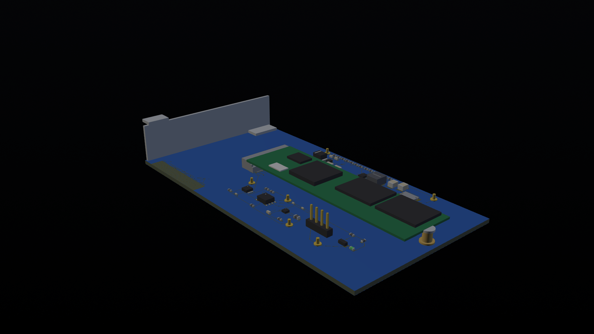
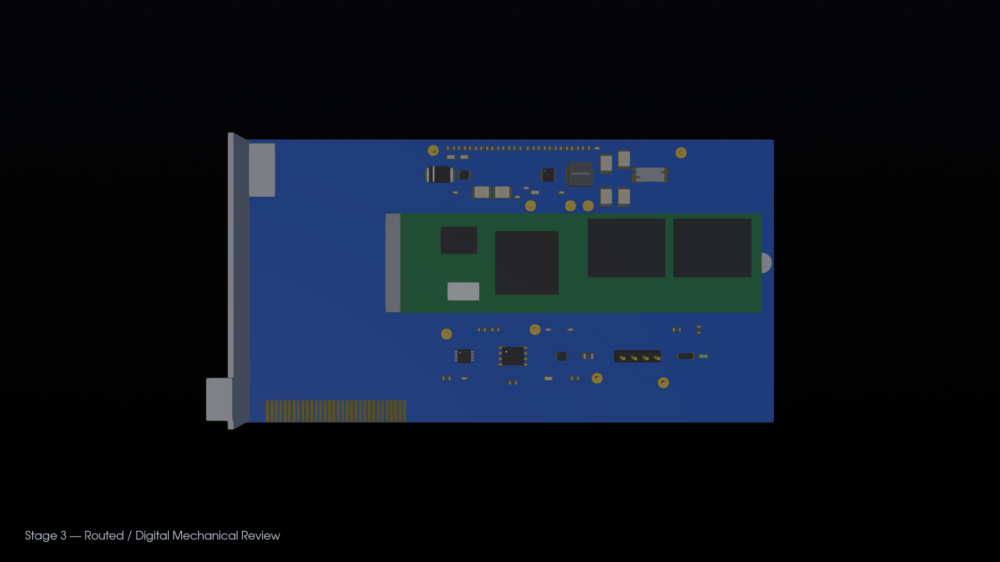
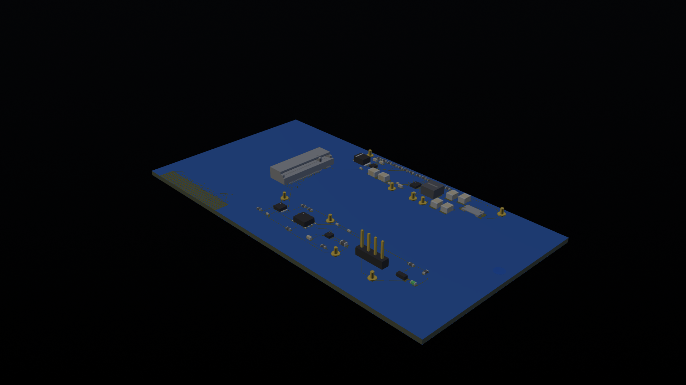

# PCIe Gen3 x4 to M.2 NVMe Adapter — NVIDIA LDE Portfolio

This repository is a curated interview portfolio for a six-layer PCIe Gen3 x4 add-in card to M.2 M-Key 2280 NVMe adapter. It demonstrates a rule-driven OrCAD X / Allegro workflow, power analysis, native 3DX review, STEP exchange, CAM outputs, and reproducible Python validation.

## Candidate profile

Electrical Engineering M.S. candidate with complementary FPGA/RTL and board-design experience. The companion thesis implements and validates AES-GCM-256 on Xilinx FPGA; this project demonstrates system-level schematic, PCB, power, mechanical, and manufacturing-document workflows.

## Status

`Interview_Digital_Complete`

This is **not** a fabrication release and does not claim PCIe compliance, universal SSD support, chassis compatibility, or bench qualification.

## Portfolio page

Open the bilingual visual project page: **[PCIe × NVMe — OrCAD Portfolio](portfolio/index.html)** or use the [published GitHub Pages site](https://erenyagar.github.io/nvidia-lde-orcad-portfolio/). Use the `中文 / EN` control in the top navigation to switch languages. It puts the three strongest assembly views first, then links each visual claim to the underlying schematic, PSpice, 3DX, STEP, CAM, and validation evidence.







## What is included

- Native Allegro board database and reusable SKILL/Tcl/batch sources.
- Capture project artifacts, pin/net/footprint matrices, ERC evidence, and netlist reports.
- PSpice plans, vendor-model metadata, and disclosed recovery-limit evidence.
- Native 3DX screenshots, collision review, STEP export/re-import evidence, and model mapping.
- Gerber artwork, NC Drill, IPC-2581-C, preliminary BOM/P&P, and assembly documentation.
- Python validators and unit tests for BOM, pin, net, 3D, delivery, and release checks.

## Start here

1. `README.md` and `PACKAGE_README.md`
2. `docs/requirements.md`
3. `docs/system_block_diagram.md`
4. `evidence/stage3/stage3_delivery_gate.md`
5. `evidence/stage3/constraint_manager_status.md`
6. `evidence/stage3/3dx_native_revk/`
7. `manufacturing/stage3_final_revk/`

## Important engineering limits

- Differential-pair width, gap, and via geometry remain fabricator-dependent until the governing JLCPCB stack-up is confirmed.
- PCIe CEM/M.2 controlled-spec sign-off is not included in this public portfolio package.
- The governing PSpice recovery case is retained as a disclosed simulation failure; no waveform is fabricated.
- Exact host-chassis, bracket, standoff, and SSD mechanical context is incomplete, so collision outcomes remain preliminary or blocked where appropriate.
- ODB++ is not supported by the installed tool; IPC-2581-C is provided as the available intelligent CAM exchange.

## Reproduction

The native binary files must be opened with the stated Cadence/OrCAD tool version. Python validation uses the standard library where possible:

```powershell
python scripts/validate_csv.py --root .
python scripts/check_bom_fields.py manufacturing/bom.csv
python scripts/check_duplicate_pins.py schematic/connection_matrix.csv schematic/symbol_pinmap.csv
python scripts/check_net_names.py schematic/connection_matrix.csv
python scripts/check_stage3_delivery.py --root .
python -m unittest discover -s scripts -p "test_*.py" -v
```

## License and third-party data

This repository is a personal interview portfolio. Vendor datasheets, symbols, models, and mechanical data remain subject to their respective owners' terms. Do not upload this package to a PCB fabricator without completing the outstanding specification, stack-up, exact-model, and physical-validation gates.
