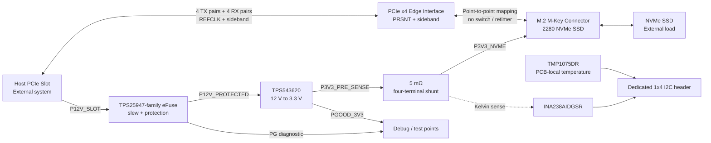
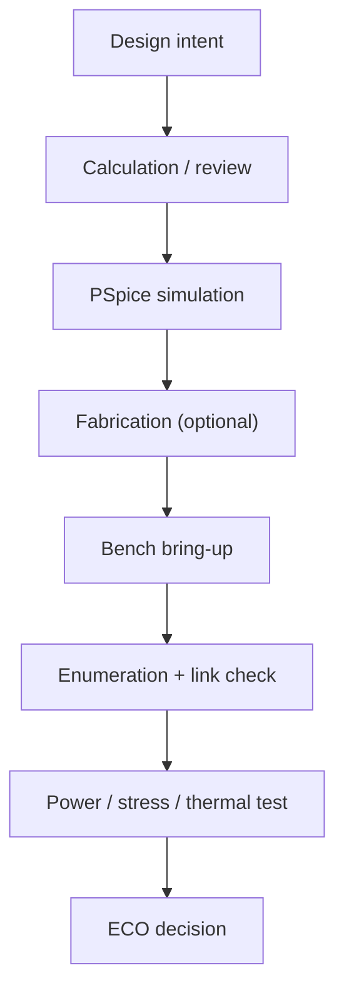

# System Block Diagram

## 系統層級



所有區塊目前是 design intent；除官方元件功能外，系統級表現為 `Planned`，量測為 `Not_Yet_Measured`。

## 高速訊號路徑

```text
Host transmitter  -> PCIe edge RX-side naming boundary -> M.2 SSD receiver
M.2 SSD transmitter -> M.2 TX-side naming boundary -> PCIe edge host receiver
```

實作時 net name 必須以清楚的 board-centric convention 消除 TX/RX 視角歧義。lane 0–3、P/N、REFCLK、PERST#、CLKREQ#、PEWAKE# 與 PRSNT 在 Gate 1 前均為 `Pending_Human_Verification`。板上不加入未經 governing specification 支持的 AC coupling capacitor、termination、CMC 或 ESD。

## Power tree

| Rail | Source | Consumers | Design intent | 狀態 |
|---|---|---|---|---|
| `P12V_SLOT` | PCIe slot | eFuse input | 主輸入；pin 與 power boundary 待 CEM review | `Pending_Human_Verification` |
| `P12V_PROTECTED` | TPS25947 family | TPS543620 | controlled startup／fault isolation | `Planned` |
| `P3V3_PRE_SENSE` | TPS543620 | COUT、shunt input | 約 3.325 V / 5.010 A normal；feedback 在 shunt 後 | `Estimated` |
| `P3V3_NVME` | shunt output | M.2 SSD、FB1 | SSD 5 A design point、7 A / 100 µs stimulus；另含 10 mA local allowance | `Engineering_Assumption` |
| `P3V3_AUX` | `P3V3_NVME` 經 FB1 | telemetry／pull-ups、U5 ADP198 input | U5 reverse-current blocker 隔離 J3 sense output；元件功能已確認，系統 injection test 未執行 | `Engineering_Assumption` |

Power Good 的邏輯、threshold、delay 與 LED loading 必須由 exact component configuration 計算；圖中只表示 intended observability。

## Telemetry boundary

- INA238 量測 shunt differential voltage 與 3.3 V bus voltage，再由 programmed calibration 計算 current／power。
- TMP1075 量測其 PCB placement 鄰近溫度；不能宣稱 SSD controller junction temperature。
- I²C reader 在板外；板上不放 MCU。
- Header pin 4 是 3.3 V sense/reference，不是外部電源輸入口。
- I²C address、pull-up ownership、bus voltage 與 alert use 在 schematic freeze 前確認。

## 六層功能分配

| Layer | 用途 | Reference／限制 |
|---|---|---|
| L1 | components、PCIe high-speed、power stage | 高速主要參考 L2 |
| L2 | solid GND | 不得跨 plane split |
| L3 | sideband／control | 依 stack-up 確認 reference |
| L4 | power distribution | 不作 L1 高速 reference |
| L5 | solid GND | L6 高速／低速 return reference |
| L6 | low-speed、必要 edge breakout | 使用 L5；換層需 return via |

實際 thickness、copper、trace width、gap 與 via geometry 皆為 `Pending_Fabricator_Confirmation`。

## 驗證邊界



- Calculation 輸出可標為 `Estimated`。
- 真正執行且可重現的 PSpice 輸出可標為 `Simulated`。
- Bench evidence 才能將對應項目由 `Not_Yet_Measured` 升級。
- Enumeration／link check 不等同 PCIe Compliance Test。
